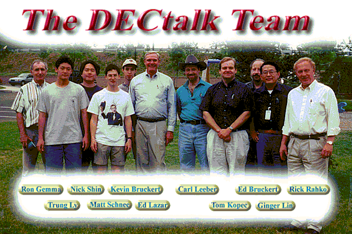

# DECtalk

These files were shared by their original developer [late Edward Bruckert](https://bluegrasspals.com/pipermail/dectalk/2020-June/005253.html) on the DECtalk list in [Oct](https://bluegrasspals.com/pipermail/dectalk/2015-October/004517.html)/[Nov](https://bluegrasspals.com/pipermail/dectalk/2015-November/004535.html) 2015 and preserved on a HTTP server on [datajake.braillescreen.net](https://datajake.braillescreen.net/tts/DECtalk%20source%20code%20archive/Ad%202.zip). Another developer also added more code in 09/2022 which is also preserved in the [same location](https://datajake.braillescreen.net/tts/DECtalk%20source%20code%20archive/).

## Try it out!

- [Latest downloads on GitHub Actions](https://github.com/dectalk/dectalk/actions/workflows/build.yml)
- [Try it out in your web browser with WebAssembly](https://webspeak.terminal.ink/)

## Community

We're currently living out in [Discord](https://discordapp.com/invite/wHgdmf4) - Come have a chat!

## Branches of Interest

- `master` Literally just the source code dumped into the `/src` folder.
- `develop` Working Linux/Windows binaries (i386, x86_64 and aarch64), MacOS/iOS (Apple Silicon and Intel).

## Building

### Linux

<details>
<summary>Setting up on Ubuntu Linux</summary>

If you're building on Ubuntu, obtain the following dependencies:

```sh
apt-get install build-essential libasound2-dev libpulse-dev libgtk2.0-dev unzip git
```

(libgtk2.0-dev is only needed if you want the graphical frontend, libasound2-dev if you want ALSA sound output and libpulse-dev if you want pulseaudio audio-output)

</details>
<details>
<summary>Compiling on Linux</summary>

```sh
# Run all these commands in the /src directory...
cd src

# Generates configure files
autoreconf -si

# Executes configure files
./configure

# Builds DECtalk with ALL cores (remove -j for single core)
make -j
```

The built files will be found in the `/dist` folder.

</details>
<details>
<summary>Compiling on Linux with Docker</summary>

To build DECtalk without setting up a local build environment, run `sudo docker-compose up`
(and make sure you have Docker and docker-compose installed!)

</details>

### Windows

<details>
<summary>Visual Studio 2022</summary>

Install Visual Studio 2022, enabling the "Desktop development with C++" workload from the Visual Studio Installer.

Optionally, also install the ARM64 build tools (untested) to create ARM64 binaries for Windows on ARM.

You can then open [`\src\DECtalk.sln`](./src/DECtalk.sln) in Visual Studio.

</details>

<details>
<summary>Visual Studio 6</summary>

#### Setup

There's a great article on CodeProject which explains how to install Visual Studio 6.0 from scratch.
[Read it here](https://www.codeproject.com/Articles/1191047/Install-Visual-Studio-on-Windows)

You will also need to add your `vcvars32.bat` file to the environment variables.
Do this by adding `C:\Program Files (x86)\Microsoft Visual Studio\VC98\Bin` to your Windows system `PATH`.

#### Compilation

The [`\devops\vs6\dt_buildall.bat`](./devops/vs6/dt_buildall.bat)
file is a great place to get started if you want to build individual components of DECtalk.

If you want to compile all files, execute the `\devops\vs6\dt_buildall.bat` file
from the root of the project folder.

You can then collate all files together by executing the `\devops\vs6\dt_copyfiles.bat` file.

</details>

### MacOS
<details>
<summary>Xcode command line tools</summary>

#### Setup
Install Xcode command line tools. From the terminal:

```% xcode-select --install```

Or you may trigger an install by typing any of the following from the terminal:

```git```

```clang```

```gcc```


#### Compilation
```
cd src/
./configure
make -j
```

The built files will be found in the `/dist` folder.

</details>

## The Team


